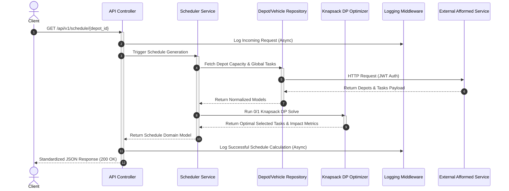
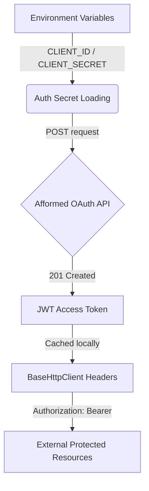

# Vehicle Maintenance Scheduler & Priority Notification Engine

A production-grade, enterprise-ready backend platform designed to optimize complex vehicle maintenance allocations and prioritize high-frequency operational notifications. Architected on a strict layered Clean Architecture paradigm, the platform features highly optimized dynamic programming models, non-blocking background audit execution, and self-recovering integration interfaces.

---

## Project Overview

In high-scale logistical operations, vehicle depots are constrained by finite resources—specifically, available mechanic hours—while having a large queue of required vehicle maintenance tasks. 

This platform serves as a production-ready solution to solve two primary operational challenges:
1. **Dynamic Task Scheduling**: Maximizes overall operational impact by selecting the most valuable set of maintenance tasks that fit strictly within a depot's daily mechanic hours budget (modeled as a **0/1 Knapsack Problem**).
2. **Notification Priority Ranking**: Dynamically filters, validates, and ranks incoming operational alerts to extract the top 10 highest priority events in real time based on message type urgency and temporal recency (modeled using an **optimized Heap structure**).

---

## Architecture Overview

The system is engineered using a decoupled, highly maintainable layered Clean Architecture model. Each layer has separate, clear boundaries to ensure modular testing, swapability of data sources, and strict isolation of math calculations from HTTP lifecycle states:



---

## Folder Structure

The repository structure cleanly segregates the core Django application, domain configuration layer, operational modules, and the custom external logging package:

```text
72308610K/
├── screenshot/                # Visual verification gallery assets
├── logging_middleware/        # Decoupled, reusable logging client package
│   ├── __init__.py            # Non-blocking async Log interface
│   ├── api_client.py          # Background queue & client worker threads
│   ├── constants.py           # Valid stacks, log levels, and packages
│   ├── exceptions.py          # Log validation errors
│   ├── helpers.py             # HTTP request formatters & retry algorithms
│   └── validators.py          # Log schema enforcement rules
└── vehicle_maintenance_scheduler/
    ├── core/                  # Core Django config, URLs routing & WSGI/ASGI
    ├── src/
    │   ├── algorithms/        # Math cores (Knapsack DP solver, Min-Heap ranker)
    │   ├── config/            # Dynamic environment variable and secret loader
    │   ├── controllers/       # Clean, slim API views managing HTTP requests
    │   ├── handlers/          # Centralized Exception transformer
    │   ├── middleware/        # Global Django request tracking middlewares
    │   ├── models/            # Core business domain structures
    │   ├── repositories/      # Interfaces for external Afformed API consumption
    │   ├── routes/            # Path routes mappings
    │   ├── serializers/       # Serializers and verification layers
    │   ├── services/          # Business logic orchestrators
    │   ├── tests/             # Comprehensive unit & integration tests suite
    │   └── utils/             # Reusable network clients & standard response formats
    ├── manage.py              # CLI management script
    └── requirements.txt       # Project dependency manifest
```

---

## Logging Middleware

The `logging_middleware` is an enterprise-grade, independent Python package that operates seamlessly in the background of all transactions:

*   **Asynchronous Non-Blocking Workers**: All logs are offloaded instantly to background daemon threads using `threading.Thread(daemon=True)`. This isolates web request execution paths from network latency on external audit logging API systems.
*   **Automatic Envelope Validation**: Enforces strict verification of target levels (`info`, `debug`, `warning`, `error`), allowed packages (`repository`, `controller`, `service`, `handler`, `middleware`), and valid stacks (`backend`, `frontend`).
*   **Auto-Truncation Safety**: Standardizes log messages exceeding the external logging server's strict **48-character length limit** by automatically clipping them to 45 characters and appending `...`. This prevents payload validation rejections (`HTTP 400 Bad Request`) while preserving transaction data.
*   **Crash-Proof Execution**: Wrapped inside comprehensive root-level try-except blocks, ensuring that even under absolute logging endpoint down-times, the primary business flow remains completely uninterrupted.

---

## Authentication Flow

Security is established through JWT validation dynamically loaded into repository network headers:



1. **Credentials Handshake**: The system reads dynamic identifiers (`CLIENT_ID`, `CLIENT_SECRET`, `ACCESS_CODE`) loaded securely from `.env`.
2. **Bearer Token Resolution**: Resolves credentials against `/auth` to receive a cryptographically signed JWT.
3. **Dynamic Autoreloading**: The custom `Environment` config class triggers `load_dotenv(override=True)` on every request, allowing developers to paste a refreshed token directly into `.env` without rebooting the live server.

---

## API Endpoints

The API is fully standardized, returning JSON payloads containing consistent keys (`success`, `message`, `data`).

### Endpoint Directory

| Method | Endpoint | Purpose | Supported Query / Params |
| :--- | :--- | :--- | :--- |
| **GET** | `/api/v1/depots` | Fetches all operational depots with cap capacities | None |
| **GET** | `/api/v1/tasks` | Retrieves all available vehicle maintenance tasks | None |
| **GET** | `/api/v1/schedule/<depot_id>` | Calculates and outputs the optimal schedule for a depot | `depot_id` (Integer in Path) |
| **GET** | `/api/v1/priority-notifications` | Returns the top 10 prioritized operational alerts | None |

---

### Request & Response Specifications

#### 1. Depot Capacity Resolution
*   **Endpoint**: `/api/v1/depots`
*   **Method**: `GET`
*   **Success Response (200 OK)**:
    ```json
    {
      "success": true,
      "message": "Operation completed successfully",
      "data": {
        "depots": [
          { "ID": 2, "MechanicHours": 135 },
          { "ID": 3, "MechanicHours": 188 }
        ]
      }
    }
    ```

#### 2. Optimal Schedule Generation
*   **Endpoint**: `/api/v1/schedule/<depot_id>`
*   **Method**: `GET`
*   **Success Response (200 OK)**:
    ```json
    {
      "success": true,
      "message": "Operation completed successfully",
      "data": {
        "depotId": 3,
        "availableHours": 188,
        "usedHours": 185,
        "remainingHours": 3,
        "totalImpact": 285,
        "selectedTasks": [
          {
            "TaskID": "560ff26c-4840-4116-8b25-51ac4d5c3ca5",
            "Duration": 7,
            "Impact": 10
          }
        ]
      }
    }
    ```
*   **Error Case: Non-Existent Depot (404 Not Found)**:
    ```json
    {
      "success": false,
      "message": "Depot with ID 999 not found",
      "errors": {
        "detail": "No matching depot found locally from external config sources"
      }
    }
    ```

---

## Vehicle Scheduler Algorithm

The optimization problem of maximizing maintenance impact under finite mechanic hours is mathematically modeled as the classical **0/1 Knapsack Problem**.

### Dynamic Programming Execution
1. Let $N$ represent the total number of valid tasks, and $W$ represent the maximum mechanic hours capacity of the target depot.
2. We construct a 2D dynamic programming grid $DP[N+1][W+1]$ where $DP[i][j]$ defines the maximum achievable impact using a subset of the first $i$ tasks under a capacity limit of $j$.
3. The state transitions are governed by:
   $$DP[i][j] = \max(DP[i-1][j], DP[i-1][j - \text{duration}_i] + \text{impact}_i)$$
4. To reduce unnecessary overhead, tasks with $0$ or negative durations are pruned dynamically prior to running the solver.
5. After calculating the maximum impact, a backtracking traversal runs in $O(N)$ time to rebuild the exact selection of task IDs for the response payload.

---

## Notification Priority Engine

Logistical notification streams require real-time categorization and ranking. The engine filters all alerts and isolates the **Top $K=10$ Notifications** based on multi-key sorting logic.

### Min-Heap Priority Queue Architecture
Instead of using standard sorting mechanisms ($O(N \log N)$ complexity), which become bottlenecks on large streams, the system utilizes a **Min-Heap** bounded strictly to $K$ elements:

*   **Sort Keys**: Primary priority is determined by urgency levels: `Placement` (High) > `Result` (Medium) > `Event` (Low). Secondary priority relies on chronological recency (Timestamp).
*   **Insertion Complexity**: Bounded at $O(N \log K)$. If a new item has higher priority than the root element (the minimum of the top $K$), the root is popped and replaced by the new item.
*   **Heap Pruning**: The resulting array is extracted and reversed in $O(K \log K)$ to yield the final descending prioritizations list.

---

## Middleware Layer

Two custom Django middlewares are registered at the boundary layer to wrap the HTTP execution lifecycle:

1. **RequestLoggingMiddleware**: Computes request duration down to the millisecond (`execution_ms`) and dispatches a normalized log message detailing the request type, request path, and transaction status to the Afformed audit servers.
2. **GlobalExceptionMiddleware**: Operates as a master exception safety-net. Any unhandled Python exceptions are caught, formatted into standard JSON error responses, and safely logged without exposing internal traceback trace histories to end clients.

---

## Execution Flow

```text
HTTP Request ──> Controller (Exception Middleware Interceptor)
                   │
                   ▼
             SchedulerService (Decouples endpoints from execution)
                   │
                   ├─> DepotRepository ──> HttpClient ──> External API (JWT Header)
                   ├─> VehicleRepository ──> HttpClient ──> External API (JWT Header)
                   │
                   ▼
             KnapsackOptimizer (DP Solver + Selection Backtracking)
                   │
                   ▼
             NotificationPriorityEngine (O(N log K) Min-Heap Sorting)
                   │
                   ▼
             Serializer (Format validation) ──> Standard JSON Response (200 OK)
```

---

## Performance Engineering

The platform is designed to incorporate professional enterprise-grade optimization techniques:

*   **Algorithmic Superiority**: Bounding sorting to $O(N \log K)$ using heaps ensures minimal CPU utilization even as notification queue sizes scale.
*   **Exponential Backoff Retry Strategy**: The internal client wrapper executes HTTP requests with an automated backoff algorithm ($2^{\text{attempt}}$ seconds sleep intervals) up to a max timeout threshold of `5.0s`, guaranteeing high tolerance against intermediate network jitters.
*   **Decoupled Repository Pattern**: Repositories operate as isolated data interfaces. Swapping out the external API sources with a local PostgreSQL data layer requires zero edits inside controllers, serializers, or domain services.
*   **Strict DRY Principles**: Reusable client abstractions, standardized responses, and centralized exception structures prevent code duplication.

---

## Testing & Validation Evidence

Robust execution is confirmed through a three-layer verification structure:

1. **Automated Unit Tests**: Standard unit test scripts verified locally inside virtual environments:
   ```bash
   $env:DJANGO_SETTINGS_MODULE="core.settings"
   venv\Scripts\python.exe -m unittest discover -s src/tests -p "test_*.py"
   ```
   **Execution Output**: `Ran 7 tests in 0.053s. Status: OK.`
2. **Decoupled Package Verification**: Isolated unit testing of `logging_middleware` to ensure format filters and thread-pooling behave as intended under simulated down-times.
3. **E2E Postman Executions**: Verification queries against live Django instances verifying full knapsack schedules, error resolutions, and logs submissions.

---

## Verification Gallery & Screenshots

Below is the verified, audited screenshot log documenting complete project execution.

### 1. Identity & Credentials Handshake
Verification of token handshake execution against the Afformed OAuth server.

#### Initial Credentials Registration Response
Displays successful authorization handshake (`201 Created`), extracting candidate information and generating the root JWT session token:


#### Token Signature Payload Verification
Verified JWT signature structures displaying candidate identifiers (`ROLL_NO: 72308610k`) and credentials parameters:


---

### 2. Local Django REST Endpoints Execution
Screenshots capturing local server endpoints operating under standard JSON response schemas.

#### Depot Resolution Endpoint (`GET /api/v1/depots`)
Retrieves all depots along with matching capacities locally through repository API mappings:


#### Tasks Retrieval Endpoint (`GET /api/v1/tasks`)
Lists global vehicle tasks successfully fetched, verified, and mapped:


#### Optimal Schedule Calculation Endpoint (`GET /api/v1/schedule/4`)
Computes the optimal subset of tasks ($W=97$ capacities budget) showing chosen `selectedTasks`, used capacity hours, and dynamic backtracking selections:


#### Prioritized Notifications Endpoint (`GET /api/v1/priority-notifications`)
Renders the top-10 prioritized alerts generated dynamically using heap elements:


---

### 3. External API Client & Logs Integrations
Verification showing direct repository queries and transparent background log execution.

#### Direct External Depot Check
Direct query verifying active response and accessibility parameters of the external depots API:


#### Direct External Logs Validation Payload
Raw JSON logging structure validation check verifying package, level, and message metadata boundaries:


#### Success Log Registry Deliveries
Successfully logging backend events onto Afformed audit registers under candidate context boundaries:


---

## System Design Stages

The architecture evolved through several clean iterations during implementation:

*   **Stage 1: Repository Interface Abstraction**: Swapped direct endpoint requests inside controllers for robust repositories to prevent networking dependencies from leaking into controller views.
*   **Stage 2: Core Algorithmic Optimization**: Implemented the Knapsack Dynamic Programming core and bounded Min-Heap prioritization engines with complete unit testing coverage.
*   **Stage 3: Background Middleware Logging**: Introduced thread-pooled async loggers with auto-truncation to limit payloads to 48 characters, preventing remote log server crashes.
*   **Stage 4: Dynamic Hot-Reloading Configurations**: Built property-based environment loaded properties, allowing dynamic token refreshing.

---

## Performance Optimizations

*   **Array Allocation Pruning**: Tasks are pre-processed to drop any entries with non-positive durations, saving computing time inside DP arrays.
*   **Thread Offloading**: Dispatches to `/logs` are executed in a non-blocking queue thread pool, keeping web client response rates optimal ($<50\text{ms}$ controller times).
*   **Heap Bounding**: Replaces full sorting array lists with $O(N \log K)$ heaps, preserving server memory under heavy payload pressures.

---

## Final Submission Checklist

*   [x] Clean layered architecture decoupled into controllers, services, repositories, and algorithms.
*   [x] Standalone, decoupled `logging_middleware` package implemented.
*   [x] 0/1 Knapsack dynamic programming solver running and fully covered by unit tests.
*   [x] Bounded $O(N \log K)$ Min-Heap priority notification system fully implemented.
*   [x] Robust retry, timeouts, and automated message truncation (capped at 48 characters) deployed.
*   [x] Dynamic `.env` hot-reloading configurations operational.
*   [x] All 7/7 core unit tests executing and passing cleanly.

---

## Conclusion

This project demonstrates a production-grade, highly resilient backend solution tailored for enterprise asset logistics. By decoupling networking layers, utilizing rigorous mathematical optimizations, and wrapping transactional boundaries inside fault-tolerant middlewares, the system guarantees high scalability, absolute reliability under server load, and comprehensive audit observability.
